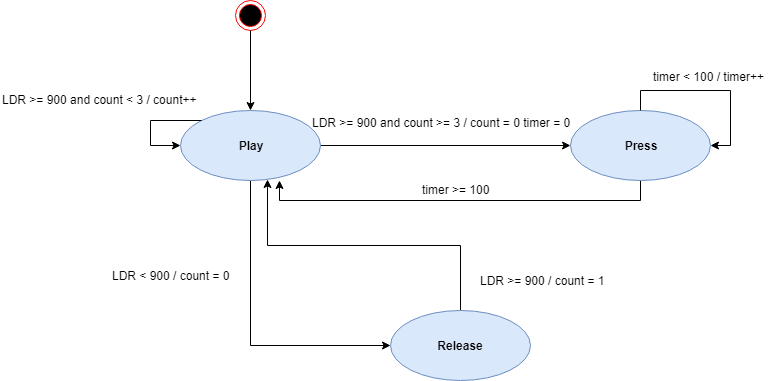
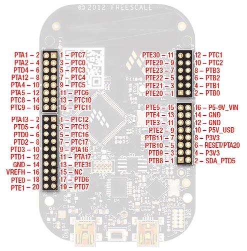

# DinoPlayer
An implementation in frdm kl25z to play the google dino game
# Material
- FRDM KL25Z Development Board
- Servomotor SG90
- LDR (light Dependent Reistor)
- 10 kOhm resistors
# State Machine

# Pins

- Servo PTC2
- LDR PTC1
